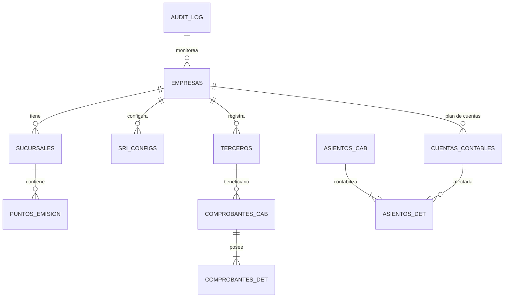

## Arquitectura de Base de Datos - EcuContable Pro (PostgreSQL)

## Visión General
El sistema utiliza un diseño **Multi-tenant** puro, donde el aislamiento de datos se garantiza mediante la columna `empresa_id` en todas las tablas transaccionales. Además, se implementa una **Trazabilidad Total** vinculando cada registro a un `usuario_id`.

## Características Técnicas de Alta Disponibilidad

1.  **Multi-Tenancy (empresa_id)**: 
    - Todas las consultas están optimizadas mediante **Índices Compositos** que inician con `empresa_id`.
    - Garantiza que la información de una empresa nunca sea visible para otra.
2.  **Trazabilidad de Usuario (usuario_id)**:
    - Cada movimiento (Asientos, Facturas, Kardex, Bancos) registra el ID del usuario que realizó la operación.
    - Campos obligatorios `created_by` y `usuario_id` en tablas maestras y transaccionales.
3.  **Auditoría de Contexto**:
    - Se utiliza un trigger avanzado que captura el usuario de la sesión de base de datos (`app.current_user_id`), permitiendo auditoría incluso en operaciones manuales por DBA.
4.  **Identificadores UUID**: Unicidad garantizada en entornos distribuidos.

## Diagrama Entidad-Relación (E-R)

## Características Técnicas Implementadas

1.  **Identificadores (UUID)**: Todas las tablas utilizan `UUID v4` como llave primaria. Esto garantiza unicidad global y facilita la sincronización de datos entre sucursales.
2.  **Auditoría Integral**: 
    - Se implementó un esquema de auditoría basado en la tabla `audit_log`.
    - Un **Trigger centralizado** captura cambios (OLD/NEW data) en formato JSONB.
    - Campos `created_at` y `updated_at` con TimeZone para trazabilidad temporal.
3.  **Parametrización SRI**: La tabla `sri_configs` permite gestionar múltiples ambientes (Pruebas/Producción) y almacenar certificados electrónicos (.p12) de forma independiente por empresa.
4.  **Integridad mediante ENUMs**: Se utilizan tipos enumerados para estados de comprobantes, tipos de cuenta y regímenes impositivos, evitando inconsistencias de strings.
5.  **Optimización**: Índices B-Tree creados estratégicamente en fechas, claves de acceso y campos de búsqueda frecuente (`identificacion`).

## Guía de Despliegue

Para inicializar la base de datos, ejecute el script:
`psql -U usuario -d ecucontable -f database/postgres_schema.sql`

## Mapeo de Módulos

| Módulo | Tablas | Propósito |
| :--- | :--- | :--- |
| **Núcleo** | `empresas`, `sucursales`, `sri_configs` | Configuración multi-empresa y firma electrónica. |
| **Directorio** | `terceros`, `transportistas` | Clientes, proveedores y logística. |
| **Contabilidad** | `cuentas_contables`, `asientos_cab`, `asientos_det` | Motor contable y estados financieros. |
| **SRI / Facturación** | `comprobantes_cab`, `comprobantes_det`, `puntos_emision` | Ciclo de vida del documento electrónico. |
| **Inventario** | `productos`, `kardex`, `categorias_producto` | Control de stock y costos (FIFO/Promedio). |
| **Bancos** | `cuentas_bancarias`, `movimientos_bancarios` | Conciliación y flujo de caja. |
| **Nómina** | `empleados`, `roles_pago` | Liquidación de haberes. |
| **Auditoría** | `audit_log` | Trazabilidad de cambios y seguridad de datos. |
